  

> 미리보기
> - 💡 [프로젝트 소개](#1-프로젝트-소개)
> - 📌 [주요 내용](#-주요-내용)
> - ☀️ [타 서비스와 차별점](#13-기존-서비스-대비-차별성)
> - 🎥 [시연 영상](#4-소개-및-시연-영상)
> - 🙇🏻‍♂️ [팀 소개](#5-팀-소개)
 

## 1. 프로젝트 소개
### 1.1. 개발배경 및 필요성
#### 1.1.1. 개발 배경 

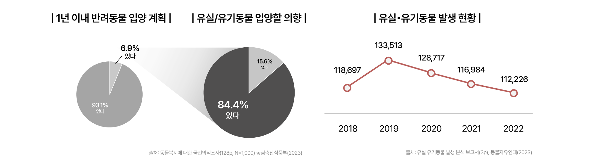

> 한국에서는 반려동물 입양 의향이 증가하고 있지만, **유기동물 발생률은 여전히 높고**, **보호소를 통한 입양률은 낮은** 상황입니다. 주요 문제로 **낮은 보호소 입양률**과 **부족한 보호 인프라**가 대두되고 있습니다.  
 

#### 1.1.2. 문제 정의 
i. 입양 경로의 불투명성 문제
 
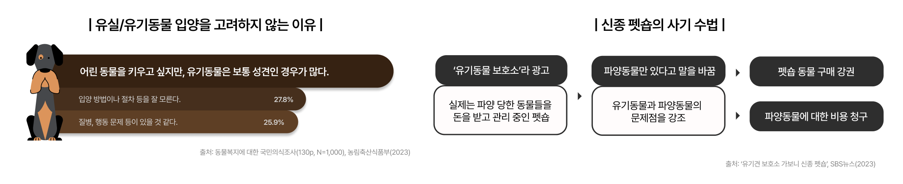

>  신뢰할 수 없는 입양 경로로 인해 입양자들이 혼란을 겪고 있습니다. 일부 입양 경로는 유기동물을 미끼로 삼아 불필요한 지출을 유도하며, 입양자들에게 혼란을 주고 있습니다. 이로 인해 **신뢰할 수 있는 입양 경로**의 필요성이 대두되고 있습니다. 

 
ii. 보호소는 일손 부족, 봉사자는 참여 기회 부족 
 

> 보호소는 일손이 부족하고, 봉사자들은 참여에 어려움을 겪고 있습니다. **보호소와 봉사자를 연결**하여 양측의 필요를 효과적으로 맞추고자 합니다. 

 

#### 1.1.3. 문제 해결의 필요성과 방안 
> 앞서 언급한 두 가지 문제는 개인 차원에서 해결하기에 **한계**가 있습니다. 
> 이러한 이유로, 우리는 이 두 가지 문제를 **웹 서비스**로 해결하고자 합니다. **ForPaw**는 유기동물 입양과 봉사활동을 더욱 쉽게 만들어줍니다.  

 

| 🔻Problem   | 1️⃣ 봉사자와 보호소 간 수요·공급이 불일치  | 2️⃣ 불투명한 입양 경로로 인한 혼란  |
|-------------------|----------------|--------------------|
| Why1  | 연결고리와 정보의 부재 | 입양자의 정보 부족 |
| Why2  | 일부 동아리와 단체에게만 제공된 기회 | 상호명에 대한 법적 규제 미비 |
| Why3  | 대중적이고 가시적인 봉사 신청 방법/플랫폼의 부재 | 제도적 지원과 관심이 부족 |
| **Solution**  | **봉사자와 보호소를 잇는 기능** | **신뢰 가능한 보호소와 입양자를 연결하는 기능** | 

 

### 1.2. 개발 목표 및 주요 내용 

#### 1.2.1 개발 목표 

**5 Whys 분석법**을 통해 페인포인트를 정의하고, 이를 해결하기 위한 유기동물 서비스를 기획했습니다. 그리고 아래 두 가지 대목표를 설정했습니다. 

#### 1.2.2. 컨셉 

> - **ForPaw**는 "for"와 "paw(발자국)"를 결합하여, 온전히 동물을 위한 서비스라는 의미를 담고 있습니다. 
> - 브랜드 컬러인 오렌지(#FF6636)는 활동적이고 긍정적인 이미지를 상징하며, 유기동물에 대한 관심과 사랑을 상징합니다. 
> - 동물의 발자국과 얼굴을 형상화한 아이콘과 손글씨 로고를 조합하여, 브랜드 친근감을 높였습니다. 

#### 1.2.3. 사용자 

> - **일반 사용자**는 로그인 후 서비스가 제공하는 대부분의 기능을 이용할 수 있습니다.
> - **보호소 관리자**는 회원가입 시 보호소 관리자로 등록되며, 지역 보호소의 봉사활동을 **조직**하고 **관리**하는 역할을 수행합니다.
 

### 1.3. 기존 서비스 대비 차별성

| 기능            | ForPaw | 포인핸드 | 종합유기견보호센터 |
|---------------|------|---------|---------|
| **유기동물 입양** | ✅ 공공데이터 활용, 실시간 위치 기반 | ⚠ 보호소 정보 일부 누락 | ⚠ 개인 간 거래로 정보 부정확 |
| **모임 만들기** | ✅ 보호소 연계 모임 생성 | ❌ 제공하지 않음 | ❌ 제공하지 않음 |
| **봉사활동** | ✅ 전국 보호소 연계 및 직영 운영 | ⚠ 제한적 참여 (구글 폼) | ⚠ 수도권 외 모집 미미 |
| **커뮤니티** | ✅ 직관적인 질의응답 제공 | ⚠ UI 비직관적, 사용성 낮음 | ❌ 제공하지 않음 |
| **질의응답** | ✅ 가능 | ❌ 제공하지 않음 | ✅ 가능 |

 

## 2. 상세설계

### 2.1. 시스템 구성도

#### 2.1.1. 아키텍쳐 
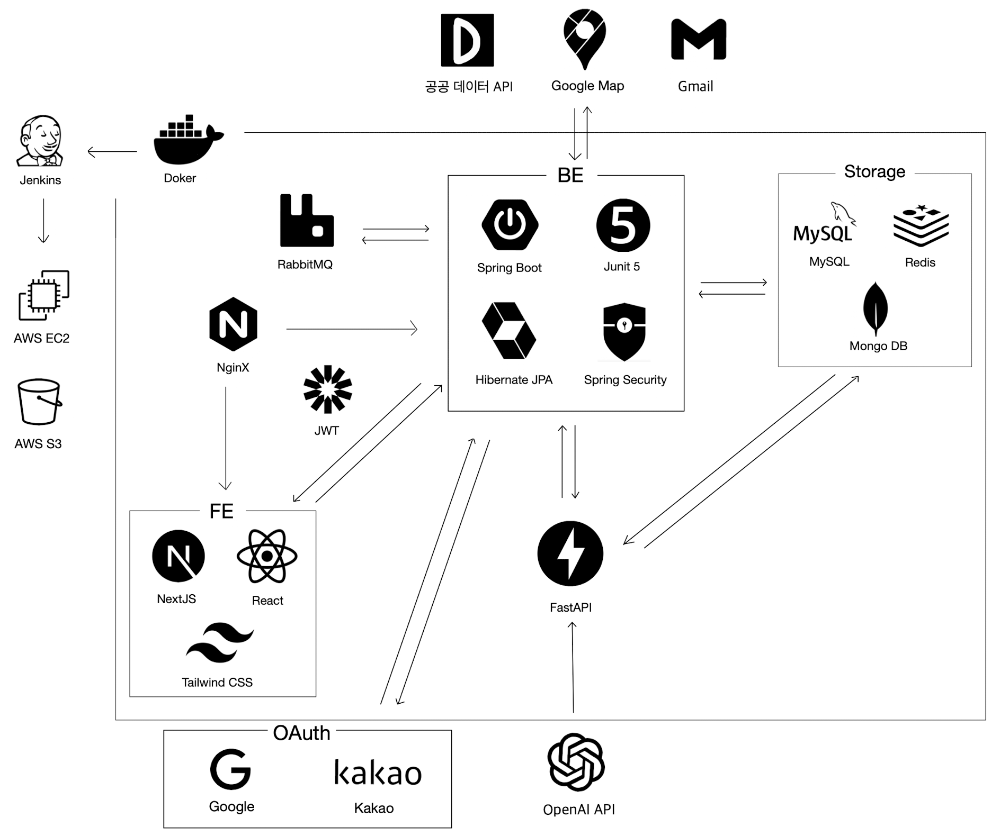
 

> - Spring Boot는 보호소 관리, 입양 지원, 봉사활동 모임 및 커뮤니티 기능 등 **핵심 기능**을 담당. 
> - FastAPI는 **OpenAI API**를 이용해 유기동물의 특징을 바탕으로 자연스러운 **소개글**을 작성하는 기능을 담당.  
> - 공공 데이터 API는 유기동물 및 보호소의 **상세 정보**를 제공. 
> - Google Maps API는 보호소 주소를 위도·경도로 변환하여 **위치** 데이터를 제공.  
> - RabbitMQ는 채팅 시스템에서 **메시지 브로커** 역할을 하고, 안정적인 비동기 메시지 전송을 담당.  
> - MongoDB는 채팅 데이터를 **저장**하여 대화 기록을 관리하고, 빠른 검색을 지원.
> - JWT를 활용해 사용자 **인증**을 처리하고, Google OAuth 및 Kakao OAuth로 간편 로그인을 제공.
 

#### 2.1.2. 웹 보안 체계 
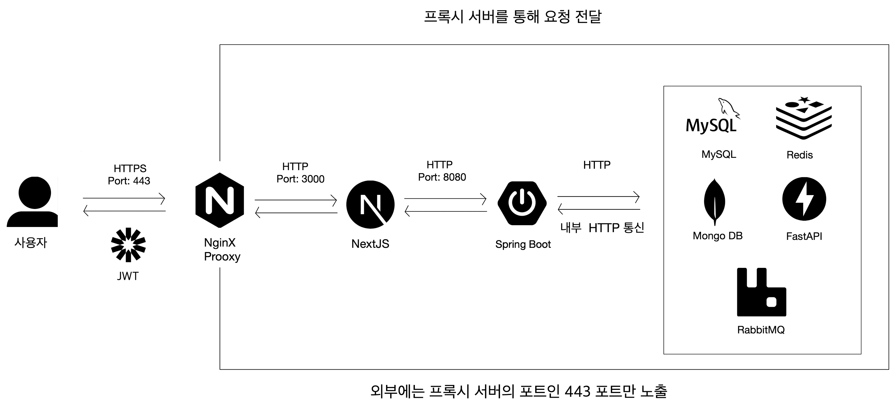
 

> - 모든 트래픽은 Nginx(443 포트)를 통해 암호화된 **HTTPS**로만 접근 가능하며, Let’s Encrypt SSL 인증서를 적용하여 보안 강화.
> - **내부 네트워크**에서만 Spring Boot ↔ MySQL, Redis, MongoDB, FastAPI, RabbitMQ 간 통신 수행.
> - Refresh Token은 httpOnly Secure 쿠키를 통해 전달되어 **XSS** 공격을 방지하고, SameSite 속성을 설정하여 **CSRF** 공격을 차단.
> - Access Token **만료** 시, Next.js가 Refresh Token을 활용하여 Spring Boot에  새로운 Access Token **발급** 요청.
> - JPA의 **파리미터 바인딩**을 활용한 안전한 쿼리 실행으로 **SQL Injection** 방지.
> - **Rate Limiting**을 적용하여 대량의 요청을 차단하고, **CORS** 정책을 통해 허용된 도메인에서만 API 접근 가능하도록 설정.

 

#### 2.1.3. 유기 동물 데이터 수집 및 처리 과정 
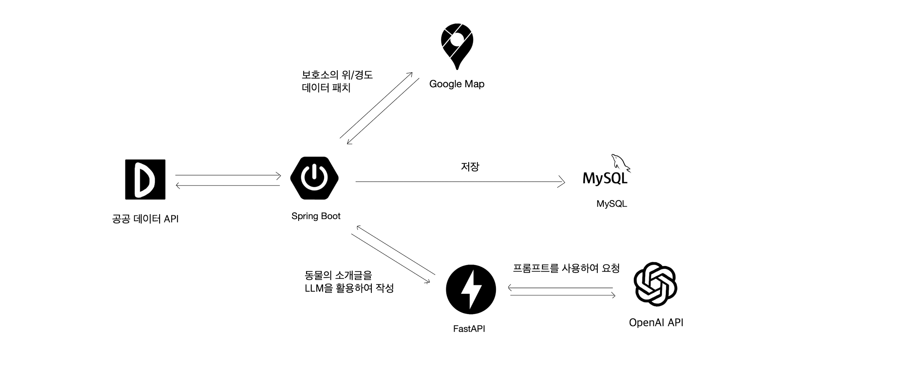 

> 1. Spring Boot의 cron job이 주기적으로 공공 데이터 API를 통해 최신 유기동물 및 보호소 정보를 **업데이트**. 
> 2. 보호소 주소는 Google Maps API를 통해 **위도·경도**로 변환되고, 이후 사용자 위치를 기준으로 근처 보호소를 지도에 표시하는 데 활용. 
> 3. FastAPI는 OpenAI API를 이용해 유기동물의 **소개글**을 생성. 
> 4. 최종적으로 모든 데이터는 MySQL에 저장되어 관리. 

 

#### 2.1.4. ERD 
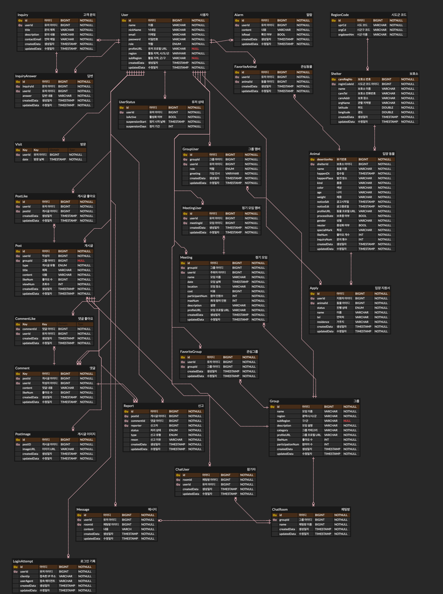
 

### 2.2. 사용 기술
| 번호 | 기술          | 버전  | 번호 | 기술         | 버전  |
|:----:|:------------:|:-----:|:----:|:-----------:|:-----:|
| 1    | MySQL        | 8.0.33 | 8   | NextJS      | 12    |
| 2    | Java JDK     | 17.0.9 | 9   | Junit5      | 5.10.2 |
| 3    | JWT          | 4.3.0  | 10  | Nginx       | 1.26  |
| 4    | MongoDB      | 2.2.0  | 11  | Tailwind CSS| 3.4.3 |
| 5    | RabbitMQ     | 3.13.0 | 12  | Jenkins     | 2.452.2 |
| 6    | FastAPI      | 0.110.3 | 13  | Gradle      | 8.5 |
| 7    | Spring Boot  | 3.2.0  | 14  | Figma       | UI3 |
 

## 3. 개발결과
### 3.1. 서비스 구조도 (IA) 

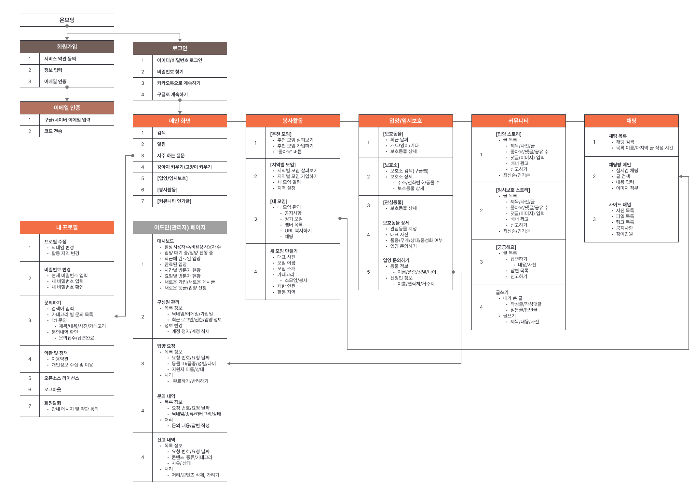
 

### 3.2. 기능 설명  

<table>
  <thead>
    <tr>
      <th style="width: 20%;">기능</th>
      <th style="width: 40%;">미리보기</th>
      <th style="width: 40%;">설명</th>
    </tr>
  </thead>
  <tbody>
    <tr>
      <td style="text-align: center;"><strong>지역별 모임</strong></td>
      <td>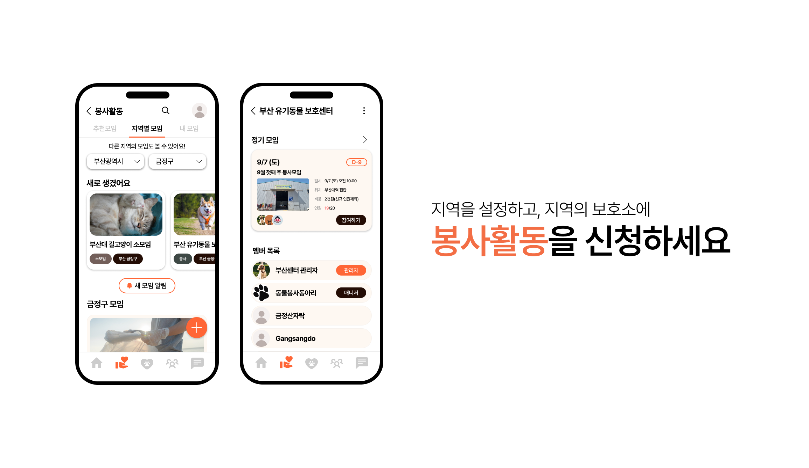</td>
      <td>- 지역 기반으로 보호소와 일반 사용자가 조직한 봉사 모임에 참여할 수 있습니다. - 보호소 직영 모임을 통해 정기적인 봉사활동이 가능합니다.</td>
    </tr>
    <tr>
      <td style="text-align: center;"><strong>보호동물 조회</strong></td>
      <td>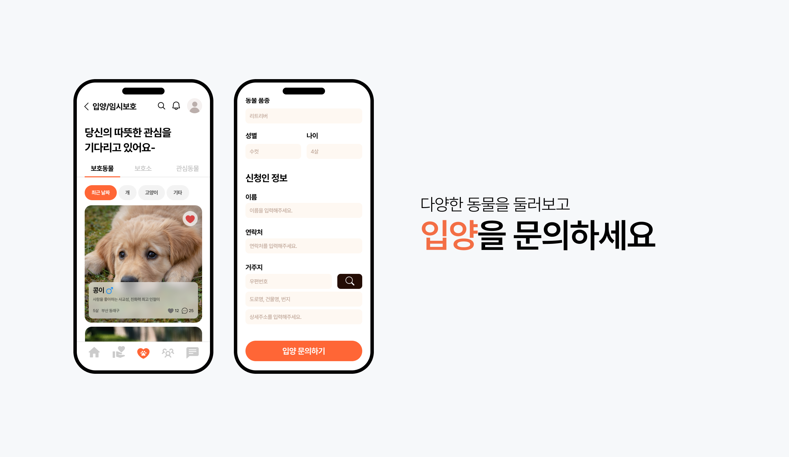</td>
      <td>- 다양한 유기동물을 필터링하여 조회할 수 있습니다. - 관심 동물로 지정하고 상세 정보를 확인하며, 입양 문의가 가능합니다.</td>
    </tr>
    <tr>
      <td style="text-align: center;"><strong>모임 관리</strong></td>
      <td>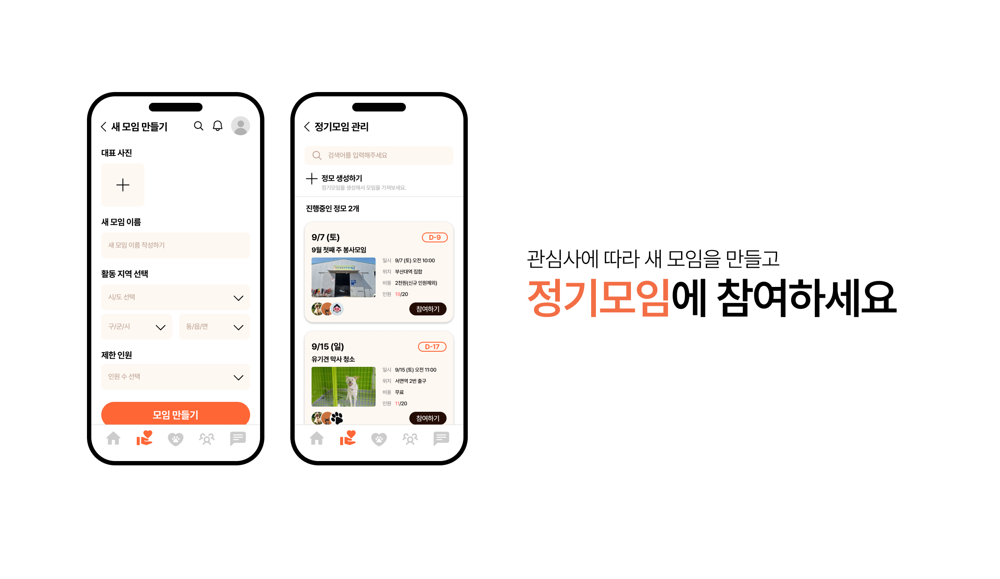</td>
      <td>- 가입 승인, 공지사항 작성, 정기 모임 조직 등 다양한 모임 운영 기능을 제공합니다. - 모임 멤버들과 실시간으로 채팅할 수 있습니다. - 사진, 파일, 링크 공유 및 공지사항 설정이 가능합니다.</td>
    </tr>
    <tr>
      <td style="text-align: center;"><strong>보호소 조회</strong></td>
      <td>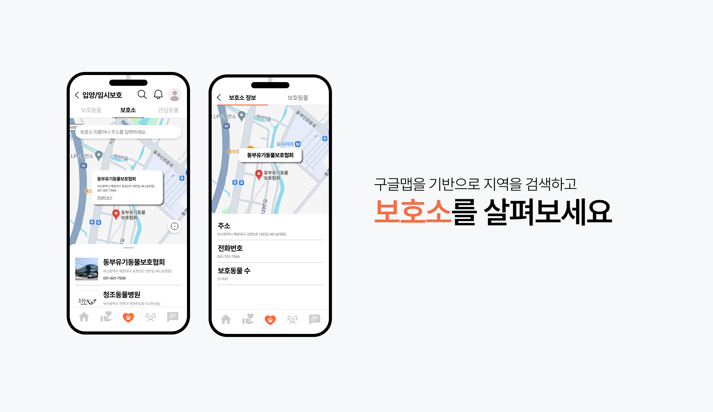</td>
      <td>- 위치 정보나 검색을 통해 전국 보호소를 조회할 수 있습니다. - 보호소 상세 정보와 보호 동물 목록을 확인할 수 있습니다.</td>
    </tr>
    <tr>
      <td style="text-align: center;"><strong>궁금해요 (Q&A)</strong></td>
      <td>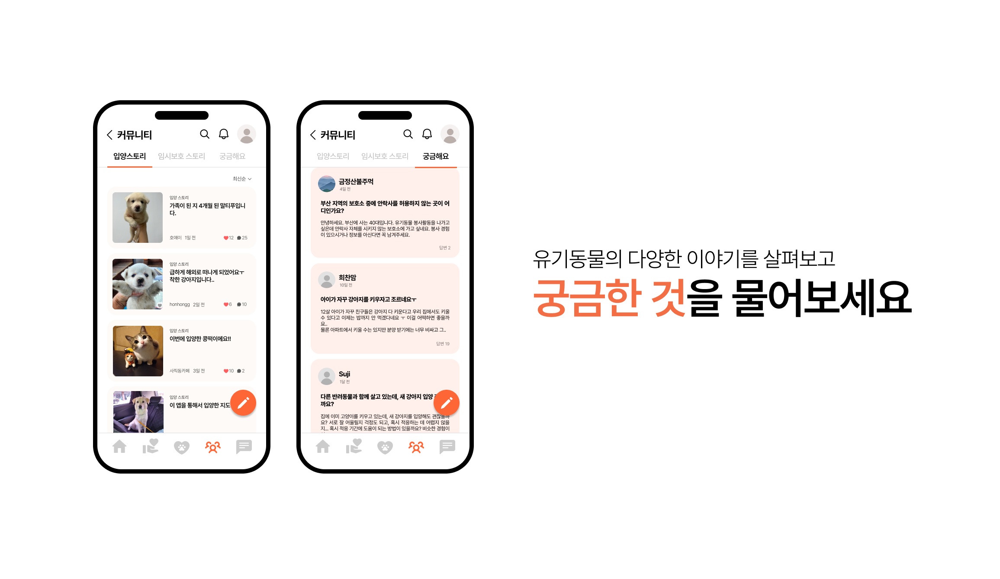</td>
      <td>- 질문을 등록하고 답변을 주고받을 수 있는 Q&A 게시판을 제공합니다. - 부적절한 게시물은 신고하여 관리할 수 있습니다.</td>
    </tr>
  </tbody>
</table>
 

### 3.3. 기능명세서
> 포포는 현재 114개의 API를 보유하고 있으며, 자세한 스펙은 아래 블로그에서 확인할 수 있습니다.  
> **API Part 1** => https://blog.naver.com/hoyai-/223363402048  
> **API Part 2** => https://blog.naver.com/hoyai-/223519299515  
 

## 4. 소개 및 시연 영상

> 🎥 **전체 시연 영상**  
> https://www.youtube.com/watch?v=0g1GArg-B5Y
 

1️⃣ **회원가입**

https://github.com/user-attachments/assets/e4e08d1d-abe4-4e7c-b25e-61040af71875

 

2️⃣ **메인 화면**

https://github.com/user-attachments/assets/2de3bee5-4646-46da-8a1b-2914adc17044

 

3️⃣ **봉사활동**

https://github.com/user-attachments/assets/71eb1ef2-a43b-4405-a437-dedd9632c99f

 

4️⃣ **입양**

https://github.com/user-attachments/assets/587b5538-1cb3-4f62-995e-2e58afab7ae2

 

5️⃣ **커뮤니티**

https://github.com/user-attachments/assets/ac284a0d-b082-472f-b7f9-5e547aba2674

 

6️⃣ **채팅**

https://github.com/user-attachments/assets/239a0d1a-fd2b-4c8a-ae5a-95ac1300bdb2

 

## 5. 팀 소개

| 이름   | 역할 | 내용 |
|:----:|:----:|------|
| 이종일  | FE | <ul><li>전체적인 레이아웃 구현</li><li>SSR을 활용하여 사용자 요청에 따른 효율적인 동적 데이터 처리 구현</li><li>SSR과 JWT 토큰 기반 인증으로 효율적인 로그인 상태 관리 및 접근 제어 로직 개발</li><li>WebSocket을 활용한 실시간 메시지 송수신 단체 채팅방 구현</li><li>S3를 활용하여 채팅방에서 사진 및 파일 업로드 기능 추가</li><li>구글 맵 API를 활용하여 보호소 위치 시각화</li><li>입력 폼에서 실시간 피드백을 제공하는 마이크로 메시지 로직 설계 및 구현</li></ul> |
| 장재영  | FE | <ul><li>봉사활동, 검색, 관리자 페이지 구현</li><li>React와 next.js를 이용한 효율적인 웹페이지 구현</li><li>Redux 라이브러리를 이용한 봉사활동 직급에 따른 기능 변경</li></ul> |
| 이한홍  | PL/BE | <ul><li>REST API 및 DB 모델 설계</li><li>Spring Boot를 활용한 메인 API 개발</li><li>공공 데이터 API 기반 유기동물 데이터 수집 및 처리 파이프라인 구현</li><li>FastAPI와 OpenAI API를 활용하여 유기동물 소개글을 자동 생성하는 기능 구현</li><li>Spring Security와 JWT를 활용한 인증 시스템 구현 및 Google, Kakao 소셜 로그인 기능 구현</li><li>RabbitMQ를 메시지 브로커로 활용하여 비동기 이벤트 기반 실시간 채팅 구현</li><li>AWS EC2에 애플리케이션 배포 및 Jenkins 기반 CI/CD 파이프라인 구축</li><li>관리자 페이지 UI/UX 디자인</li></ul> |
| 박정우  | BE | <ul><li>Spring Boot를 활용한 관리자 페이지 API 개발 </li></ul> |
| 최현빈  | PM | <ul><li>시장 리서치 및 주제 방향성 설정</li><li>데이터를 기반으로 기능 개선 방안 도출</li><li>기획서 작성 및 발표 자료 제작</li></ul> |
| 박영빈  | UI/UX | <ul><li>메인 페이지 UI/UX 디자인</li></ul> |
